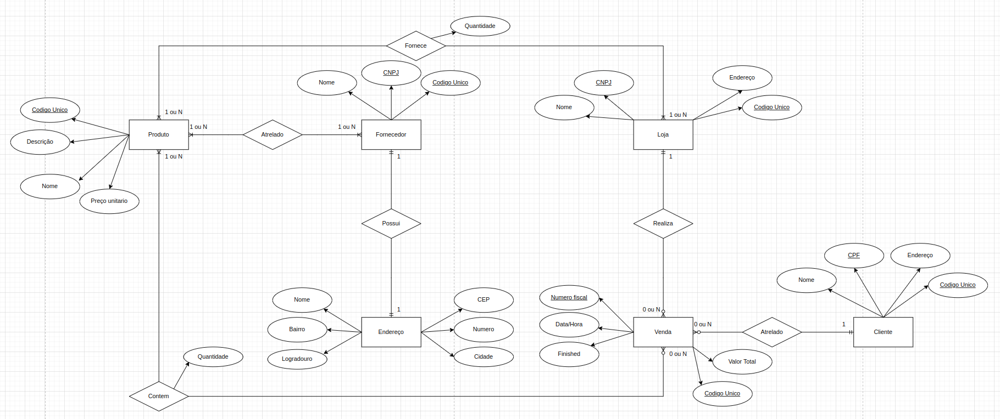
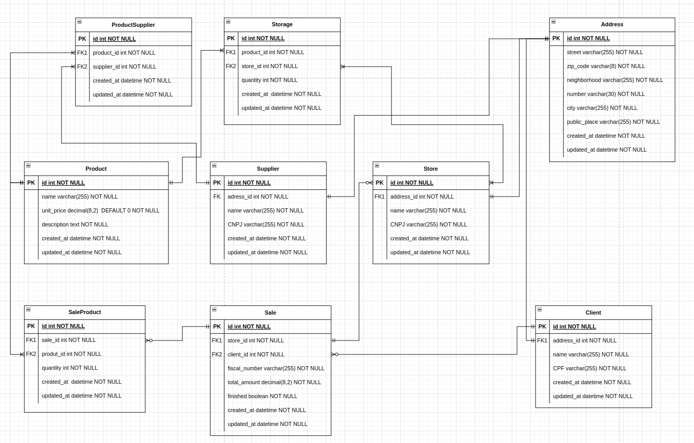

# RARO-GEEK

Projeto prático das aulas de Active Record,Models e Diagramas.

O Projeto tem como objetivo criar o sistema de vendas de uma empresa comercializadora (Raro Geek) de produtos de informática.

# Tecnologias Utilizadas

- Rails
- Rubocop
- Dbeaver
- Active Record
- Postgres

# Setup 
- Antes de iniciar a aplicação
```
cd exercicio-semana-9
bundle install
rails db:create
rails db:migrate
rails db:seed
```

# Criação de Diagramas 
O projeto foi iniciado com a interpretação das entidades, atributos e relacionamentos vistas no problema elaborado.

Após isso foi criado os Diagramas:
## Diagrama de Entidade Relacionamento


<br>


## Diagrama Logico Relacional


<br>

# Criação do projeto
- Para a aplicação foi escolhido como banco de dados o Postgres, o comando utilizado para criação do projeto foi:

```
rails new -T raro_geek --database=postgresql
```


<hr>


# Implementação 

- Apos criação do projeto, os diagramas foram codificados com a criação de migrations nas ordens corretas e as models.
- Uso de modificadores nas migrations
- Criado Referencias e associações para cada model.
- Criado validações em cada model 
- Criado callbacks e scopes necessários para as regras de negocios

- Criação de seeds 


# Desafios 

Nesse projeto, tive como maior desafio a interpretação do diagrama de entidade-relacionamento, criar callbacks e scopes para as regras de negocio, as quais achei bastante confusas para serem implementadas.


<hr>


## AUTOR
Este projeto foi desenvolvido por Klaus Lube, como parte do exercício semanal da Raro Academy(Professor Guilherme Andrade) para aprimorar as habilidades em Active Record, models, migrations e rails.